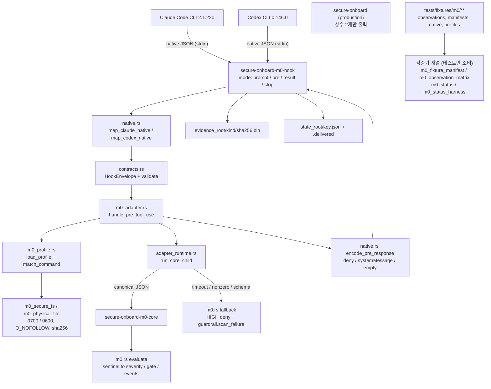

# 프로젝트 개요 (2026-07-30 전체 리뷰)

> 상태: 리뷰 기록 (비계약 문서). 제품 정책 정본은 `docs/plan/decisions.md`, 게이트 판정 정본은 `docs/review/README.md`이다.
> 기준일: 2026-07-30
> 이번 리뷰 세션에서 쓰기 도구로 새로 만든 저장소 내 산출물은 `docs/review/2026-07-30-*.md` 6개뿐이다. 작업 트리의 미커밋 수정 8건(`README.md`, `docs/plan/*` 5개, `docs/review/*` 2개)은 mtime 기준 이번 리뷰 이전 변경분이며, 미추적 구현·증거와 함께 `2026-07-30-04` §2.3에서 자산 보존 문제로 다룬다.
> 이 문서 계열이 쓰는 `Critical`/`High`/`Medium`/`Low`는 리뷰 findings 우선순위이며, 제품 판정 등급 `HIGH`/`LOW`/`INFO`(`docs/plan/decisions.md` D4)와 무관하다.

## 1. 리뷰 대상과 범위

- 대상: 저장소 `ai-onboarding` 전체 (작업 트리 기준, 커밋 미생성).
- 목적: 프로젝트가 해결하려는 문제와 방향을 파악하고, 문서·코드·테스트·운영 구성이 그 목적에 맞는지 평가.
- 제외: `target/`(빌드 산출물), `.git/`, `scripts/__pycache__/`, `docs/draft/**`·`docs/research/**`의 개별 본문(총 78개 Markdown은 지위·인덱스 수준만 확인).
- 실행한 검증은 `2026-07-30-04-test-operation-security-review.md` §4에 명령·결과·실패 원인까지 기록했다.

### 1.1 분석한 주요 디렉터리와 파일

| 영역 | 경로 | 규모 |
|---|---|---|
| 진입 문서 | `README.md`(68행), `CONTEXT.md`(117행) | 2개 |
| 계약 정본 | `docs/plan/{decisions,proposal,workflow,use-cases,report-template}.md` | 5개 / 2,661행 |
| 실행 프롬프트 | `docs/system-prompt.md`(326행), `docs/user-prompt.md`(7행) | 2개 |
| 판정·감사 | `docs/review/README.md`, `hook-contract-and-decisions.md`, 과거 리뷰 4종 | 6개 / 1,526행 |
| 비계약 자료 | `docs/research/**`, `docs/draft/**` | 78개 Markdown |
| 라이브러리 | `src/*.rs` 14개 파일 (`lib.rs` + 13개 모듈) | 7,533행 |
| 실행 파일 | `src/bin/{secure-onboard,secure-onboard-m0-core,secure-onboard-m0-hook}.rs` | 3개 / 627행 |
| 통합 테스트 | `tests/*.rs` 18개 | 7,380행 |
| 라이브 관찰 하네스 | `tests/native-harness/*.mjs` 5개 | 3,520행 |
| 스크립트 | `scripts/validate-docs`(1,018행), `scripts/generate-m0-fixture-manifests`(739행) | 2개 |
| 배포 표면 | `plugins/{claude-m0,codex-m0}/**` | 4개 JSON |
| 개발 환경 설정 | `.claude/settings.json`, `.codex/{config.toml,hooks.json}`, `.hooks/*.sh`, `.gitignore` | — |

라인 수는 `wc -l` 실측이다(확실성: 확인됨).

## 2. 프로젝트 한 줄 설명

Claude Code CLI와 Codex CLI의 로컬 도구 호출을 실행 직전에 점검하는 **선택형 로컬 실행 가드레일**을 목표로 하며, 현재 저장소에 존재하는 산출물은 그 제품이 아니라 **M0 훅 호환성 트레이서(test-only)와 그 관찰 증거 아카이브**다.

- 목표 서술 근거: `README.md:5-7`, `CONTEXT.md:3`, `docs/plan/decisions.md` D0.
- 현재 산출물 성격 근거: `src/lib.rs:1-25`(핵심 모듈 전부 `m0-test-profile` feature 게이트), `plugins/*/.*-plugin/plugin.json`의 `description`이 "Test-only ... hook compatibility probe", `README.md:1`의 `M0 관찰 완료(검증된 보호 coverage 0) / 전체 M1 NO-GO` 선언. (확실성: 확인됨)

## 3. 해결하려는 문제

`docs/plan/proposal.md` §1 기준:

- AI·코딩에 익숙하지 않은 내부 사용자가 외부에서 받은 코드·패키지·파일을 검토 없이 설치·실행하도록 AI에게 요청한다.
- 그 결과 설치 스크립트(훅), 위장 파일, 비밀 유출 사고가 발생할 수 있다.
- 사용자는 위험을 판단할 근거가 없고, AI 클라이언트는 기본적으로 실행을 막지 않는다.

## 4. 주요 사용자

| 구분 | 내용 | 근거 |
|---|---|---|
| 1차 사용자 | AI 코딩 도구(Claude Code CLI / Codex CLI)를 쓰는 비전문 내부 사용자 | `proposal.md` §1 |
| 비대상 | 관리자가 강제 통제하는 조직 단위 감사·차단 대상 | `proposal.md` §3, `decisions.md` D1 |
| 현 단계 실사용자 | 이 저장소의 개발자 본인(관찰 실험 실행자) | `tests/native-harness/run-claude-m0.mjs:22-24`의 개인 홈 경로 기본값, `tests/fixtures/m0/manifests/*.json`의 개인 절대 경로 (확실성: 확인됨) |

## 5. 핵심 기능 (현재 실제 구현 기준)

| 기능 | 구현 여부 | 근거 |
|---|---|---|
| Claude Code `PreToolUse` 훅에서 sentinel 명령을 판정하고 `deny` 응답 | 있음 (test profile 전용) | `src/native.rs:139`, `src/m0_adapter.rs:249-375`, `src/native.rs:109-137` |
| 판정 실패 시 fail-closed(HIGH 차단) | 있음 | `src/adapter_runtime.rs:59-68`, `src/m0.rs:295-340`, `src/bin/secure-onboard-m0-hook.rs:36-70` |
| pre/result 상관(correlation)과 증거 파일 기록 | 있음 | `src/m0_adapter.rs:98-235`, `src/bin/secure-onboard-m0-hook.rs:401-418` |
| 프로필·헬퍼·셸 digest 결속과 0700/0600 사설 저장소 강제 | 있음 | `src/m0_profile.rs`, `src/m0_secure_fs.rs`, `src/m0_physical_file.rs` |
| Codex `PreToolUse` 판정 | 구조적으로 항상 중립 | `src/native.rs:273-274`(`UnsupportedPerCallWorkdir` 하드코딩) → `src/m0_adapter.rs:303-305` neutral |
| Codex 결과(`PostToolUse`) 처리 | 항상 거부 | `src/native.rs:295-296` `UnverifiedCodexResult` |
| 실제 위험 탐지 규칙(npm 설치·파일 열기·읽기 전용 검사) | 없음 | `src/m0.rs:64-74` `Invocation`은 `ShellText` 단일 variant |
| 검사 캐시 | 없음(상수) | `src/m0.rs:260,315,387` `cache_status`는 항상 `"bypass"` |
| 차단 명령 원문 pending 보관·표시 안전 변환 | 없음 | `src/m0_adapter.rs:448-465`는 고정 문자열 2종만 반환 |
| production 실행 파일 | 상수 2개만 출력하는 스텁 | `src/bin/secure-onboard.rs`(36행, `use secure_onboard::` import 0개) |

(위 표의 모든 항목: 확실성 확인됨 — 해당 파일을 직접 읽어 대조)

## 6. 주요 기술 구성

- 언어/에디션: Rust 2024, `rust-version = "1.97"` (`Cargo.toml:5-6`).
- 단일 크레이트 `secure-onboard` 0.1.0. feature `default = []`, `m0-test-profile = ["dep:libc"]`.
- 의존성 최소: `hex`, `serde`(derive), `serde_json`, `sha2`, `thiserror`, optional `libc`; dev-dependency `tempfile`. `Cargo.lock` 존재.
- release 프로필: `codegen-units = 1`, `lto = true`, `strip = true`.
- 보조 언어: Python 3(문서 검증기, fixture manifest 생성기), Node.js(`.mjs` 라이브 관찰 하네스).
- 데이터 저장: 파일 기반. 증거는 `evidence_root/<kind>/<sha256>.bin`(내용 주소), 상태는 `state_root/<상관키>.json` + `.delivered` 마커. 데이터베이스는 없다.

## 7. 전체 실행 흐름

- `PROD`는 라이브러리와 코드를 공유하지 않는다(`src/bin/secure-onboard.rs`에 `use secure_onboard::` 없음).
- `VAL` 계열은 실행 경로에서 호출되지 않고 테스트에서만 소비된다(`grep` 기준 `src/` 내 호출처는 `m0_observation_matrix` → `m0_fixture_manifest` 한 방향뿐).

(확실성: 확인됨)

## 8. 주요 모듈과 역할

| 모듈 | 행수 | 역할 | 계층 |
|---|---|---|---|
| `src/strict_json.rs` | 139 | 중복 키·후행 데이터 거부 JSON, canonical bytes/sha256 | 공통 (유일한 비게이트 모듈) |
| `src/m0.rs` | 515 | 순수 도메인: sentinel → severity/gate/event, `fallback`, `validate_*` | 도메인 |
| `src/contracts.rs` | 166 | `HookEnvelope` 정규화 + 검증 | 도메인 경계 |
| `src/native.rs` | 547 | Claude/Codex 원시 payload 매핑, 응답 인코딩 | 어댑터 |
| `src/m0_profile.rs` | 590 | 서명된 test profile 로드, 4토큰 argv 정확 매칭 | 어댑터 |
| `src/m0_adapter.rs` | 480 | 오케스트레이션 + 상관 저장소 | 어댑터 |
| `src/adapter_runtime.rs` | 194 | core 자식 프로세스 실행·격리·타임아웃 | 인프라 |
| `src/m0_secure_fs.rs` | 108 | 0700/0600 사설 경로 강제 | 인프라 |
| `src/m0_physical_file.rs` | 320 | `O_NOFOLLOW` 열기 + 메타데이터 동등성 + 스트리밍 sha256 | 인프라 |
| `src/m0_fixture_manifest.rs` | 671 | fixture manifest 전수 검증 | 검증기 |
| `src/m0_observation_matrix.rs` | 1,914 | 46 case × 2 client 관찰 행렬 검증, coverage 0 강제 | 검증기 |
| `src/m0_status.rs` | 1,442 | 설치·활성·신뢰 상태 보고서 검증 | 검증기 |
| `src/m0_status_harness.rs` | 422 | 상태 보고서 조립·파일 결속 | 검증기 |

검증기 4개 합계 4,449행은 `src/` 전체 8,160행의 약 54%다. 실제 훅 실행 경로(도메인+어댑터+인프라+bin)는 약 3,686행이다. (확실성: 확인됨 — `wc -l` 실측)

## 9. 외부 시스템과 의존성

| 대상 | 성격 | 근거 |
|---|---|---|
| Claude Code CLI 2.1.220 | 관찰 대상 호스트, 버전 등호 비교로 고정 | `src/m0_adapter.rs:269` |
| Codex CLI 0.146.0 | 관찰 대상 호스트, 버전 등호 비교로 고정 | `src/m0_adapter.rs:270` |
| Node.js `v26.5.0` | 훅 바이너리에 런타임 버전 상수로 내장 | `src/bin/secure-onboard-m0-hook.rs:31` |
| 셸 실행 파일 | sha256 지문 상수로 내장 | `src/bin/secure-onboard-m0-hook.rs:32-33` |
| macOS 26.5.2 / build 25F84 / arm64 | 관찰 행렬 헤더에서 등호 검사 | `src/m0_observation_matrix.rs:1010-1015` |
| 네트워크 서비스 | 없음. 라이브 하네스는 로컬 mock API 사용 | `tests/native-harness/run-claude-m0.mjs` |
| 데이터베이스 | 없음(파일 기반) | `Cargo.toml` 의존성 목록 |

## 10. 현재 프로젝트 상태

- 자기 선언 상태: M0 `OBSERVATION_COMPLETE_WITH_EXCLUSIONS`, 검증된 보호 coverage 0, 전체 M1·M2 NO-GO (`README.md:1`, `docs/review/README.md:1-5`).
- 코드가 이 상태를 강제한다: `src/m0_observation_matrix.rs:475-480`은 `verified_count != 0 || included_count != 0`이면 계약 위반으로 실패시킨다. 즉 "검증됐다"고 표시하는 순간 라이브러리 검증이 깨진다. (확실성: 확인됨)
- 기본 feature 빌드에서 사용자에게 제공되는 기능은 없다. `secure-onboard`는 `probe-profile`에 `{"profile":"not_supported"}`, `components`에 단일 컴포넌트 목록만 출력한다.
- CI 설정이 없다. `.github/`가 존재하지 않는다(`read .github` → `Path '.github' not found`). (확실성: 확인됨)

## 11. 전체 평가 요약

| 항목 | 등급 | 핵심 근거 |
|---|---|---|
| 목적 정의의 명확성 | 적절 | `decisions.md` D0-D13이 범위·비범위·비보장을 성문화하고 우선순위까지 명시 |
| 문서와 코드의 상태 정합성(준비도) | 대체로 적절 | coverage 0·M1 NO-GO를 문서·코드 양쪽에서 강제. 단 README의 Windows 검증 문구 등 개별 불일치 존재 |
| 문서 구조 | 대체로 적절 | 4계층 분리와 비계약 배너는 명확하나 동일 정책이 6-8개 문서에 산문 중복 |
| 코드 구조(계층·의존 방향) | 적절 | 단방향 의존, 순환 없음, 순수 도메인 분리 |
| 목적과 구현의 비중 균형 | 부분적으로 부적절 | 검증기 4,449행 vs 실행 경로 3,686행. 제품 규칙(action kind, 캐시, NOT_COVERED)은 타입조차 없음 |
| 확장 가능성 | 부분적으로 부적절 | 테스트 계획·호스트 값·coverage 0이 `src/`에 리터럴로 고정되어 M1 진입이 라이브러리 수정을 강제 |
| 테스트 | 부분적으로 부적절 | 계약 테스트 품질은 높으나 기본 `cargo test`는 5개만 실행하고 핵심 스위트는 opt-in feature 뒤에 있음 |
| 운영 가능성 | 부적절 | CI·배포·설치·보존·모니터링 수단이 없음. 단 현 단계(M0) 선언과는 모순되지 않음 |
| 보안(제품 코드) | 대체로 적절 | fail-closed·엄격 파싱·경로 검증이 두터움. 증거 원문 보존 정책 부재는 별도 문제 |
| 보안(저장소 개발 환경 설정) | 부분적으로 부적절 | 승인 우회·전 도메인 네트워크 허용이 커밋되어 있음 |
| 신규 개발자의 이해 가능성 | 부분적으로 부적절 | 빌드·테스트·증거 재현 절차가 어떤 활성 문서에도 없음 |

세부 근거는 각 영역 문서(`01`~`04`)에, 조치 순서는 `05`에 있다.

## 12. 분석하지 못한 영역과 이유

| 영역 | 이유 |
|---|---|
| `docs/draft/**`·`docs/research/**` 78개 문서 본문 | 저장소 스스로 비계약 참고 자료로 선언(`docs/draft/README.md:3`, `docs/research/README.md:3`). 지위·인덱스·충돌 여부만 확인 |
| `docs/plan/report-template.md` 1,499행 전문 | §1-§3, §8, §10 일부만 정독. 나머지 절 내부 모순 가능성은 소진하지 않음 |
| 실제 Claude/Codex가 훅 exit 70·exit 2·malformed JSON을 어떻게 해석하는지 | 호스트 CLI 실행·대화형 세션이 필요. 이번 리뷰는 저장소 정적 분석 + 저장소 정의 검증 명령만 수행 |
| `plugins/*/.codex-plugin/plugin.json` 스키마의 Codex 실제 포맷 적합성 | 외부 스펙 확인 필요. 저장소만으로 판정 불가 |
| Windows·Linux 동작 | 코드가 macOS/arm64를 등호 검사하므로 실행 불가. 다른 호스트 미보유 |
| `cargo test --features m0-test-profile` 전체 결과 | §4 기록 참조. 단일 테스트 바이너리가 장시간 실행되어 이번 리뷰 시간 내 완주 확인에 제약이 있었음 |
| LSP 기반 심볼 참조 분석 | `rust-analyzer`가 설치되어 있지 않음(도구 오류로 확인). `grep`·직접 읽기로 대체 |
| git 이력 기반 문서 최신성 | 작업 트리에 미커밋 변경이 다수 존재하여 커밋 시점 기준 판단은 신뢰도가 낮음. 파일 내용 기준으로만 평가 |
