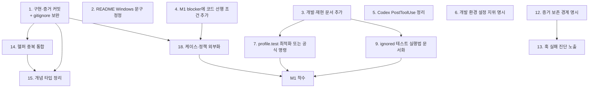

# 우선순위와 개선 로드맵 (2026-07-30)

> 상태: 리뷰 기록 (비계약 문서). 기준일 2026-07-30.
> `Critical`/`High`/`Medium`/`Low`는 리뷰 findings 우선순위이며 제품 판정 등급 `HIGH`/`LOW`/`INFO`와 무관하다.
> 근거는 `00`~`04` 문서에 있다. 이 문서는 그 결과를 실행 순서로 통합한다.

## 1. 전체 결론

이 저장소는 **선언한 단계(M0)에 대해서는 정직하고 잘 만들어진 산출물**이다. coverage 0과 M1 NO-GO를 문서와 코드가 함께 강제하고, fail-closed·엄격 파싱·경로 검증·프로세스 격리가 실제 계약 테스트로 방어된다. release 프로필에서 159개 테스트가 전부 통과한다.

문제는 세 곳에 집중된다.

1. **자산 보존**: 구현과 M0 증거 전체가 버전 관리되지 않는다. 유일한 산출물이 작업 트리 한 곳에만 있다.
2. **재현·인수인계**: 빌드·테스트·증거 재현 절차가 어떤 활성 문서에도 없고, 기본 `cargo test`는 핵심 계약을 실행하지 않는다.
3. **단계 전환 비용**: M1 진입이 라이브러리 수정을 선행 조건으로 갖는데 문서에 기록되지 않았다.

이 셋은 모두 **저비용으로 해소 가능**하다. 대규모 재설계는 필요하지 않으며 권장하지도 않는다.

## 2. 가장 먼저 해결해야 할 문제

**구현과 증거를 커밋한다.** (`04` §2.3)

`git ls-files`는 111개 문서·설정만 추적한다. `Cargo.toml`, `Cargo.lock`, `src/`, `tests/`, `plugins/`, `scripts/`, `.gitignore`가 전부 untracked이고, 추적 중인 문서 8개(`README.md`, `docs/plan/` 5개, `docs/review/` 2개)도 미커밋 수정 상태다. M0 증거는 특정 호스트(macOS 26.5.2 arm64 / Claude 2.1.220 / Codex 0.146.0 / Node v26.5.0)와 46×2 실행에 결속되어 유실 시 동등 재생성이 어렵다. 프로젝트의 GO/NO-GO 판정 근거가 여기에 있다.

선행 조건:

- `.gitignore`에 `.DS_Store`와 `.tmp*` 패턴 추가. 현재 `.gitignore`는 `/target/`, `/dist/`, `/.secure-onboard-test/`, `__pycache__/`, `*.py[cod]` 5개뿐이므로, 이미 존재하는 `./.DS_Store`·`docs/.DS_Store`·`docs/draft/.DS_Store` 3개와 테스트가 저장소 내부에 만드는 임시 디렉터리(`03` 참조)가 일괄 추가 시 함께 커밋된다.
- 개인 절대 경로가 담긴 `tests/fixtures/m0/manifests/*.json`을 이력에 포함할지 결정.
- LICENSE·provenance 결정(문서가 이미 미결로 기록).
- 미커밋 수정 문서 8건은 이번 리뷰 이전 변경분이므로 해당 작성자의 의도 확인 후 함께 커밋.

원격 공개는 별도 결정이며 `.hooks/block_git_origin_push.sh`가 push를 차단하므로 로컬 커밋만으로 유실 위험 대부분이 해소된다.

## 3. 유지해야 할 현재의 장점

건드리지 말아야 할 것들이다.

1. **coverage 0의 기계적 강제** (`src/m0_observation_matrix.rs:475-480`). M1 진입 시에도 "정책을 데이터로 옮기는" 방향으로만 완화해야 하며, 검사를 삭제하는 방향은 프로젝트의 핵심 규율을 없앤다.
2. **fail-closed의 타입 수준 강제** (`src/adapter_runtime.rs:59-68` + `src/m0.rs`의 화이트리스트 검증).
3. **production 누출 부정 계약** (`tests/production_artifact_contract.rs`). 별도 target에서 clean release를 빌드해 M0 payload 부재를 검사한다.
4. **문서 계약의 기계 검증** (`scripts/validate-docs` + `tests/docs_contract.rs`).
5. **순수 도메인 분리** (`src/m0.rs` I/O 의존 0)와 단방향 의존 구조.
6. **정본 계층과 비계약 배너**. 문서 지위·충돌 우선순위가 명시되어 있다.

## 4. 우선순위 표

| 순서 | 우선순위 | 개선 항목 | 근거 | 예상 효과 | 난이도 | 선행 작업 |
|---|---|---|---|---|---|---|
| 1 | Critical | 구현·증거 커밋 (`.gitignore` 보완 포함) | `04` §2.3 | 자산 유실 위험 제거, 제3자 검증 가능 | 낮음 | LICENSE·provenance 결정 |
| 2 | High | `README.md:54` Windows 검증 문구를 macOS arm64 실측으로 축소 | `02` §5, `01` §8 | 자체 원칙(D12) 위반 해소, 문서 신뢰도 회복 | 낮음 | 없음 |
| 3 | High | 개발·재현 문서 추가 (feature 포함 테스트 명령, `validate-docs`, 하네스 전제, 증거 경로) | `02` §5, `04` §1.4 | 회귀 은폐 방지, 인수인계 가능 | 낮음 | 없음 |
| 4 | High | M1 blocker 목록에 코드 선행 조건 추가 | `01` §8, `03` §6 | 다음 단계에서 원인 불명 검증 실패 방지 | 낮음 | 없음 |
| 5 | High | Codex 플러그인의 `PostToolUse` 등록 제거 또는 거부를 중립 처리로 변경 | `03` §6 | 도구 호출마다 발생하는 훅 실패 제거 | 낮음 | 없음 |
| 6 | High | `.claude`/`.codex` 개발 설정의 지위 명시 및 `bypassPermissions` 재검토 | `04` §3.3 | 기여자 환경의 암묵적 위험 축소 | 낮음 | 팀 합의 |
| 7 | Medium | `[profile.test]` 최적화 추가 또는 release 실행을 공식 검증 명령으로 문서화 | `04` §1.4 | 기본 스위트 실행 가능(20분+ 미완주 → 2분 내) | 낮음 | 3번 |
| 8 | Medium | `plugins/**`의 지위 명시(하네스 전용 템플릿) | `03` §6 | 설치 가능 산출물로 오해 방지 | 낮음 | 없음 |
| 9 | Medium | 무시된 2개 테스트의 실행 방법 문서화 (`-- --include-ignored` + 필요 경로·환경 변수) | `04` §1.3 | 체크인 증거와 현실의 일치 검증 경로 확보 | 낮음 | 3번 |
| 10 | Medium | `hook-contract-and-decisions.md` E·F절 갱신 또는 역사 문서로 재분류 | `02` §5·§7 | 활성 문서의 낡은 수치·해결 표기 제거 | 낮음 | 없음 |
| 11 | Medium | `decisions.md` 기준일 갱신, `research/README.md` R5 정정 | `02` §5 | 정본 최신성·결정 일관성 | 낮음 | 없음 |
| 12 | Medium | M0 증거 보존·삭제 경계를 `decisions.md` D9에 명시 | `04` §3.2 | 원문 payload 보관 정책 공백 해소 | 낮음 | 없음 |
| 13 | Medium | 훅 실패 사유를 구분 가능한 코드로 노출 | `03` §6, `04` §2.4 | 장애 원인 판별 가능, `protection_status_unknown` 구현 기반 | 낮음 | 없음 |
| 14 | Medium | 해시·경로 헬퍼 중복 통합 (`is_sha256_label` 등 4-5중) | `03` §6 | 판정 기준 분기 위험 제거 | 낮음 | 1번 |
| 15 | Medium | 개념 타입 중복 정리 (`Client`/`M0ProfileClient`, `OperatingSystem` 2곳 등) | `03` §6 | 지원 대상 확장 비용 감소 | 보통 | 14번 |
| 16 | Medium | argv 이중 파서 단일화 | `03` §6 | fail-closed 무력화 회귀 방지 | 낮음 | 없음 |
| 17 | Medium | `CLAUDE.md`/`AGENTS.md` 중복 해소 | `02` §6 | 드리프트 방지 | 낮음 | 도구 호환성 확인 |
| 18 | Medium | 케이스 테이블·호스트 기대값·coverage 정책을 fixture로 외부화 | `03` §6·§7 | M1 진입 시 라이브러리 수정 최소화 | 높음 | 1·4번 |
| 19 | Low | `CONTEXT.md` 상태·기준일 헤더 추가, hookify 규칙 경로 정정 | `02` §5·§6 | 일관성 | 낮음 | 없음 |
| 20 | Low | `src/native.rs` payload 구조체의 목적 주석 1-2줄 | `03` §6 | 계약/잔재 구분 | 낮음 | 없음 |

## 5. 즉시 수정 항목 (1주 내)

1~6번. 모두 난이도 낮음이며 5번을 제외하면 문서·설정 변경만으로 끝난다. 5번은 JSON 한 블록 제거 또는 매핑 분기 1곳 수정이다.

## 6. 단기 개선 항목 (1개월 내)

7~13번. 테스트 실행성, 배포 표면 표기, 증거 정책, 진단 노출. 이 단계가 끝나면 "새로 합류한 개발자가 저장소만 보고 빌드·검증·재현할 수 있는 상태"가 된다.

## 7. 중기 구조 개선 항목

14~18번. 중복 제거와 확장 지점 외부화. 18번은 난이도가 높고 M1 착수와 함께 수행하는 것이 효율적이다. **단독으로 먼저 하지 않는다** — M1의 실제 요구가 확정되기 전에 외부화 스키마를 설계하면 두 번 고치게 된다.

## 8. 장기 방향 검토 항목

- Codex 지원 유지 여부 결정. 현재 Codex 경로는 구조적으로 상시 중립이며(`src/native.rs:273-274`) 결과 판정도 불가능하다. "지원 클라이언트"로 계속 표기할지, `NOT_COVERED` 대상으로 명시적 축소할지는 제품 결정 사항이다.
- Windows 지원. 코드가 macOS/arm64를 등호 검사하므로 실질적 재작업이 필요하다. M3 항목으로 유지하는 것이 타당하다.
- CI 도입. 현재는 CI가 없어도 검증 명령이 명확하면 수동 실행으로 충분하다. 다만 1번(커밋)이 완료되고 기여자가 늘면 `clippy` + `validate-docs` + release 스위트를 돌리는 최소 워크플로가 비용 대비 효과가 크다.

## 9. 보류하거나 하지 않아도 되는 항목

| 항목 | 이유 |
|---|---|
| 대규모 아키텍처 재설계 | 계층 분리·의존 방향·도메인 순수성이 이미 적절하다. 문제는 구조가 아니라 확장 지점의 위치다 |
| `handle_pre_tool_use` 즉시 분해 | 127행이지만 현재 분기가 단순하다. M1에서 action kind가 들어올 때 2분할하면 충분 |
| `canonical_bytes` 이중 직렬화 최적화 | 성능 문제로 관측되지 않았다. 측정 없이 손대지 않는다 |
| 운영 런북·모니터링 스택 | 배포 대상이 없다. M3 이전에는 과도한 투자 |
| 새 문서 대량 추가 | 활성 문서가 이미 3,700여 행이고 중복 서술이 회귀 사고를 만든 이력이 있다. 개발 문서 1개만 추가 권장 |
| `production_negative.rs`의 상수 대조 테스트 개선 | 실질 방어는 `production_artifact_contract`가 담당한다. 중복 강화 불필요 |
| `docs/draft/**` 삭제 | 지위가 명확히 선언되어 있다. 공개 전 provenance 정리 시점에 함께 판단 |

## 10. 작업 간 선행 관계

- 1번은 14·15·18번의 선행이다. 커밋 없이 리팩터링하면 되돌릴 수 없다.
- 3번은 7·9번의 선행이다. 명령을 문서에 정한 뒤 그 명령을 실용화한다.
- 4번과 1번이 18번의 선행이다. 무엇을 외부화할지는 M1 요구가 확정된 뒤 결정한다.
- 2·5·6·10·11·17·19·20번은 독립적이며 병렬 처리 가능하다.

## 11. 예상 효과

| 단계 | 완료 후 상태 |
|---|---|
| 1단계 (신뢰성 확보: 1~6번) | 자산 유실 위험 제거. 문서가 실측을 넘는 주장을 하지 않음. 훅 실행 시 반복 실패 제거. 기여자 환경 위험이 명시됨 |
| 2단계 (구조 정리: 7~17번) | 저장소만 보고 빌드·검증·재현 가능. 실패 원인 판별 가능. 중복으로 인한 조용한 분기 위험 제거 |
| 3단계 (확장 준비: 18번 + M1) | 케이스·호스트·coverage 정책이 데이터가 되어 M1 진입이 라이브러리 수정을 강제하지 않음 |

## 12. 최종 권장 방향

**M0 결과를 자산으로 확정하고, 그 자산을 남이 검증할 수 있게 만든 다음 M1을 판단한다.**

구체적으로는 (a) 커밋, (b) README의 과장 1건 정정, (c) 개발·재현 문서 1개 추가, (d) M1 blocker에 코드 선행 조건 기록 — 이 4개가 이번 리뷰가 도출한 최소 필수 작업이다. 네 항목 모두 하루 안에 가능하며 코드 아키텍처를 건드리지 않는다.

그 이후의 기능 구현(action kind, 캐시, activation registry)은 `decisions.md:256`이 이미 정한 대로 native 경계를 닫거나 지원 범위를 축소한 뒤에 착수하는 것이 타당하다. 현재 코드 품질은 그 결정을 내리기에 충분한 근거를 제공한다.

## 13. 이번 리뷰에서 수행하지 않은 조치

작업 지시에 따라 기존 코드·문서를 수정하지 않았다. 따라서 다음은 **권고로만 남는다**.

- `docs/review/README.md`의 리뷰 인덱스에 이번 6개 문서를 등록하는 일. 기존 `docs/review/` 파일은 날짜 접두사 없는 주제명 규약을 쓰고 `README.md`가 상대 링크로 색인한다. 이번 파일명은 작업 지시가 지정한 `YYYY-MM-DD-NN-주제` 형식을 따랐으므로, 인덱스 등록 시 명명 규약 통일 여부를 함께 결정해야 한다.
- 위 §4의 모든 항목.
